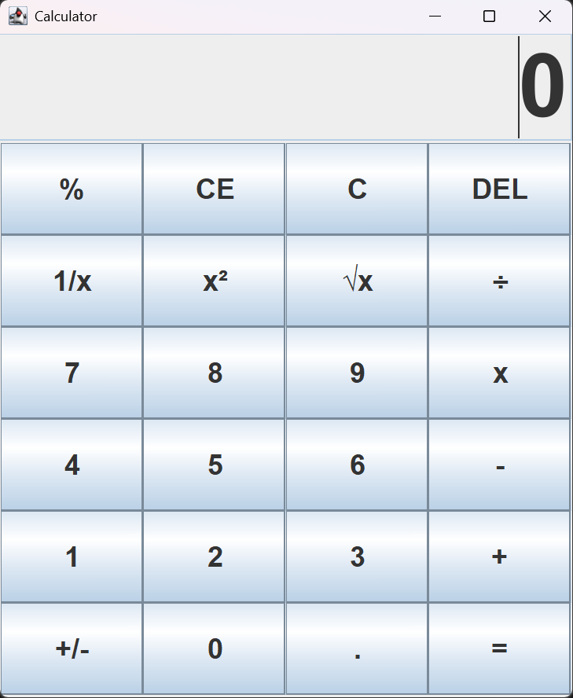

# Java Swing Calculator 🧮

A functional desktop calculator built with Java featuring a Graphical User Interface (GUI). This project was developed as part of my coursework in the Information and Computer Systems program at Camosun College (Fall 2025).

## ✨ Features
* **Interactive GUI:** Built using the Java Swing framework for a responsive user experience.
* **Advanced Operations:** Supports standard arithmetic (addition, subtraction, multiplication, division) plus advanced functions like square root ($\sqrt{x}$), square ($x^2$), reciprocal ($1/x$), and percentage (%).
* **Robust Logic:** Implements separate logic for single-operand and dual-operand operations.
* **Error Handling:** Features custom exception handling for mathematical errors, such as division by zero.

## 🛠 Technical Highlights
* **Frameworks:** Java Swing & AWT (JFrame, JPanel, JTextField, GridLayout).
* **Clean Code Architecture:** * **Separation of Concerns:** Distinct separation between the UI logic (`Calculator.java`) and the mathematical engine (`Operation.java`).
* **Event-Driven Programming:** Implements `ActionListener` for efficient user input management.
